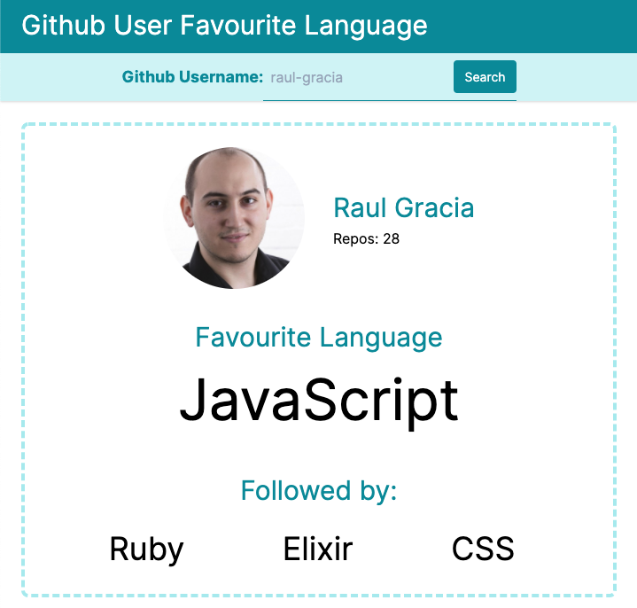

# README

Rails app to look up a github user's favourite language

### Dependencies

```
bundle install
```

### Environment Vars

Set up the github username and [personal access token](https://docs.github.com/en/github/authenticating-to-github/creating-a-personal-access-token)

```
GITHUB_USER='username'
GITHUB_TOKEN='token'
```

### Testing

```
bundle exec rspec
```

### UI


